# Monitoring-Service

----

### Консольное приложение для подачи показаний счетчиков отопления, горячей и холодной воды.
 

----

При запуске приложения вам предоставиться возможность зарегестрироваться

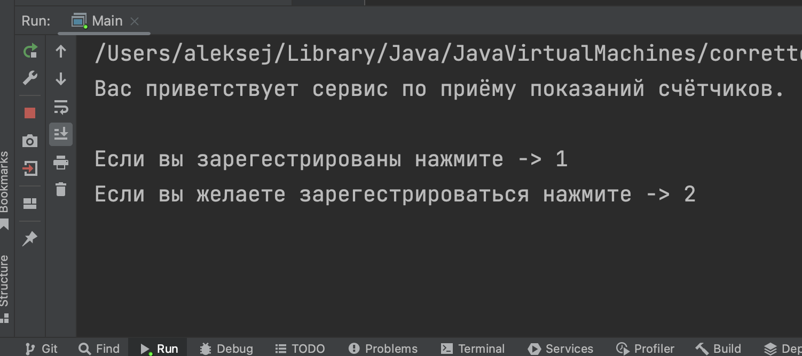

Нажмите 2 чтобы зарегестрироваться и вводите свои данные

Логин - это ваш адрес, он уникальный

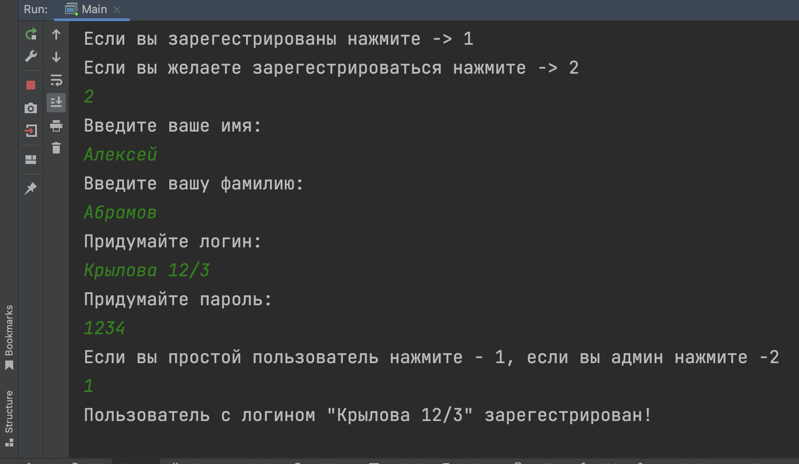

Далее авторизуйтесь

Вам откроется меню для обычного пользователы

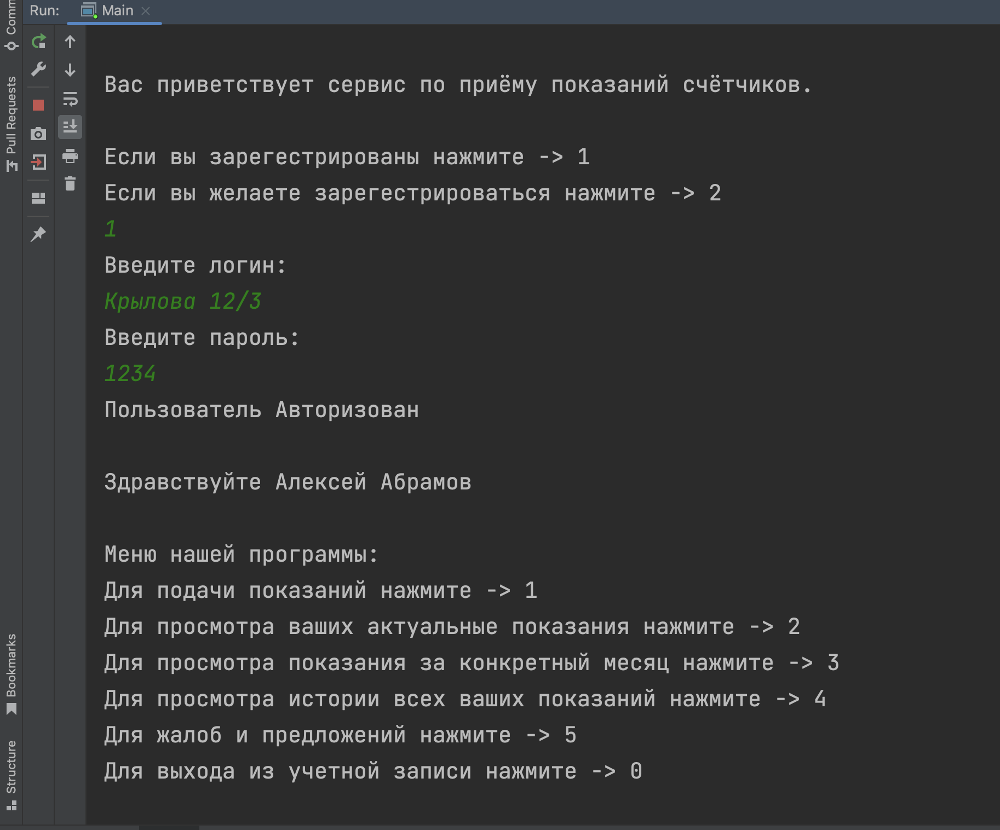

Нажав 1 вы можекте добавить позпния счетчиков

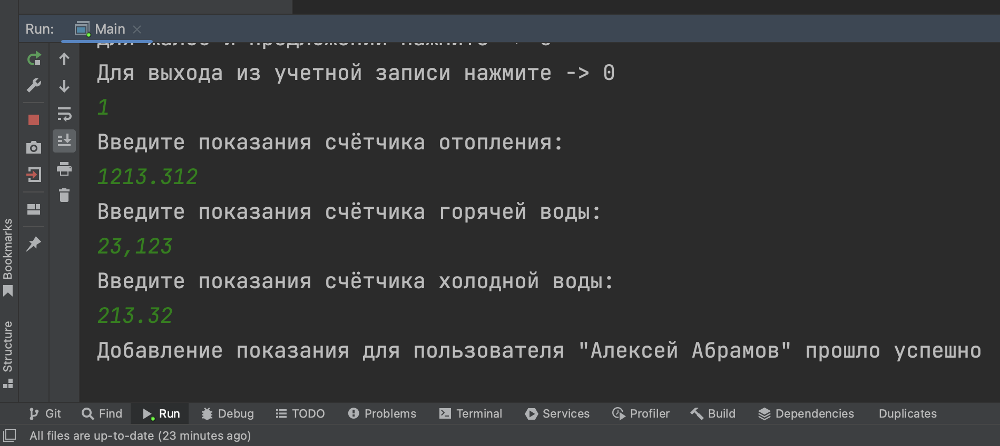

ВАЖНО! Один пользователь можнет добавлять показания счетчиков только один раз месяца

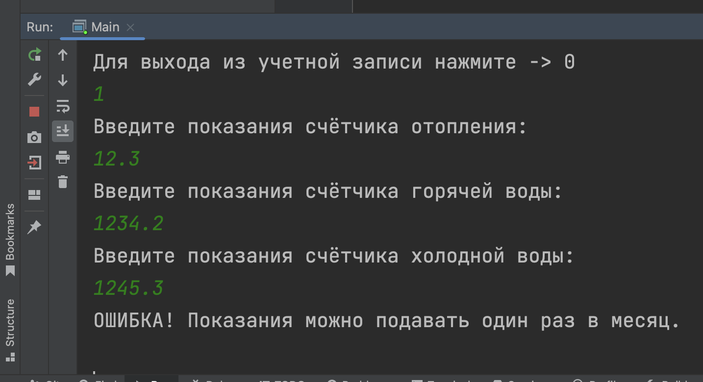

Также вы можете просматривать показания актуальные, за указанный месяц либо все ваши показания

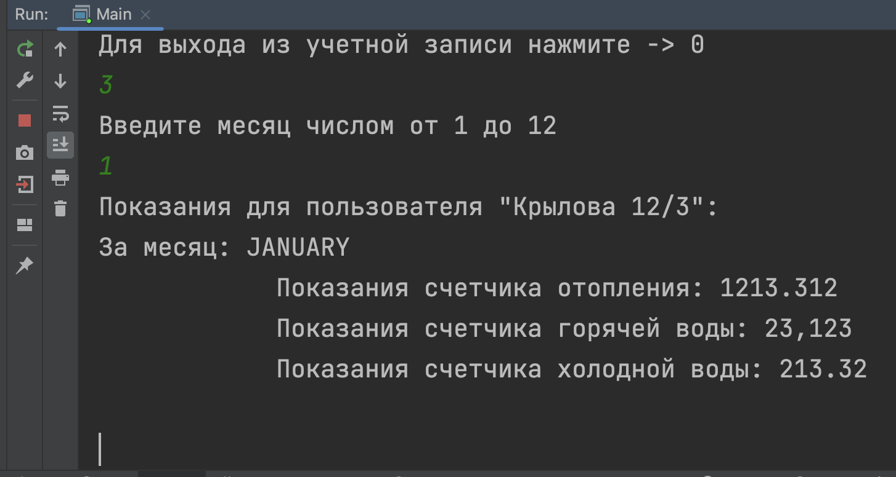

Если у вас возникли трудности или вы хотите похвалить разработчика нажмите 5

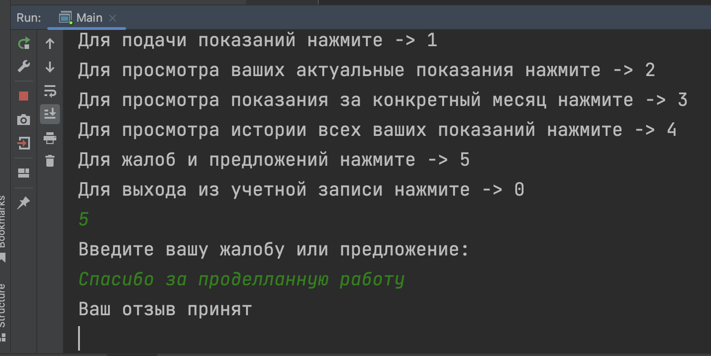

Для выхода нажмите 0 и вы сможете зайти в другую учетную запись, либо создать новую

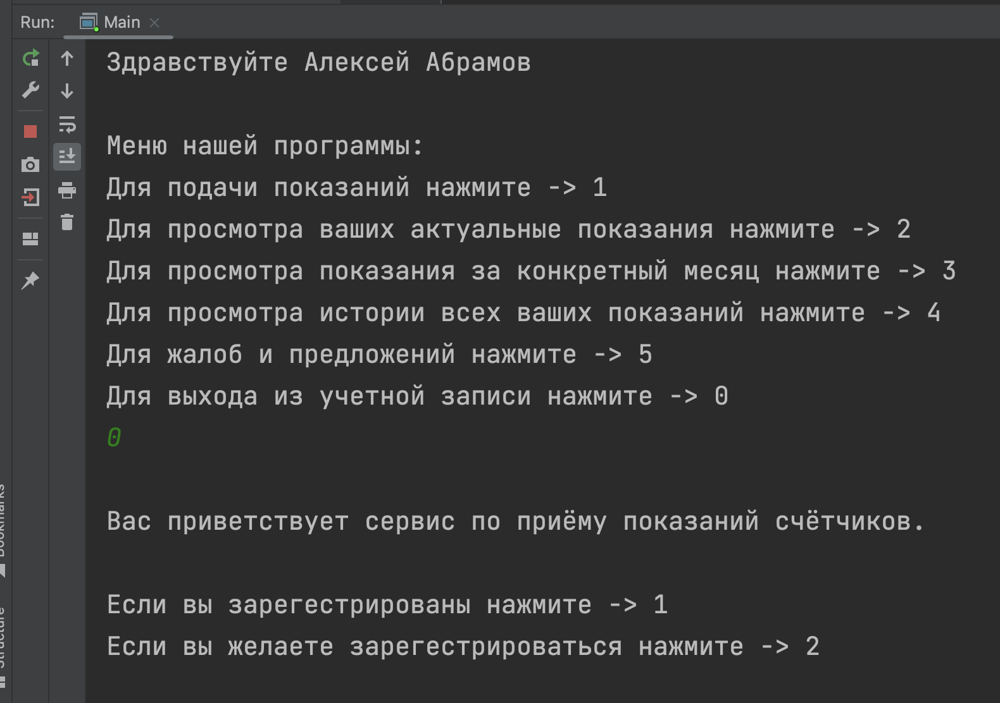

Меню админа:

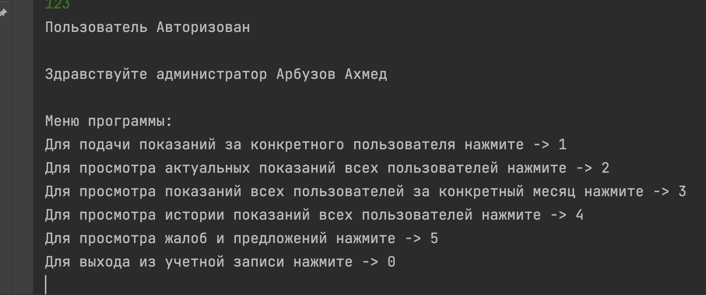

В нем вы можете просматривать все показания пользователей или подать показание за конкретного пользователя

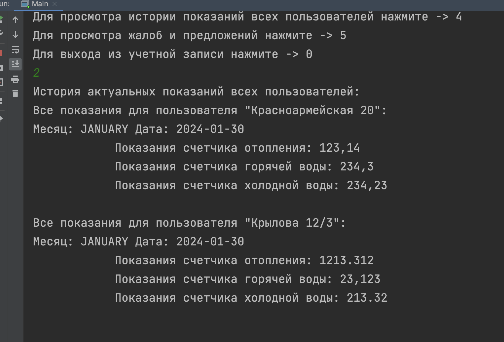

Так же вы можете читать жалобы и предложения

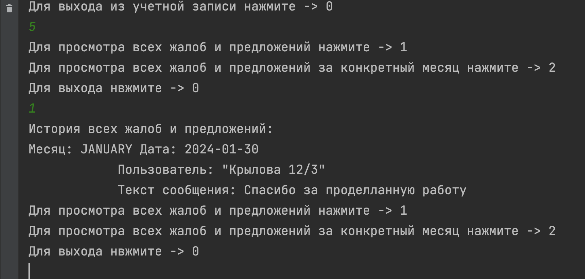

